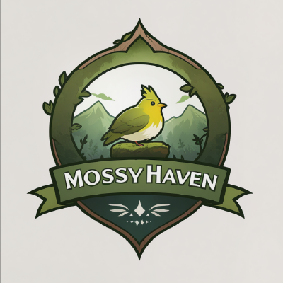
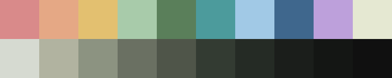

<h3 align="center">
	 
	
	Mossy Haven
	
</h3>

<h6 align="center">
  <a>/ˈmɒsi ˈheɪ.vən/</a>
</h6>

<h6 align="center">
  <a href="../Palette.md">Palette</a>
  ·
  <a href="../Projects.md">Projects</a>
  ·
  <a href="../Showcase.md">Showcase</a>
  ·
  <a href="../Doc.md">Docs</a>
</h6>

  

  
  
  
  
  

&nbsp;

  Mossy Haven is a community-driven initiative aimed at creating soothing digital environments that enhance usability and comfort. Our projects are designed to be visually appealing and easy to use, combining nature-inspired aesthetics with modern functionality.

  
  
  
  
  
  
  

Join our community!

&nbsp;

  

